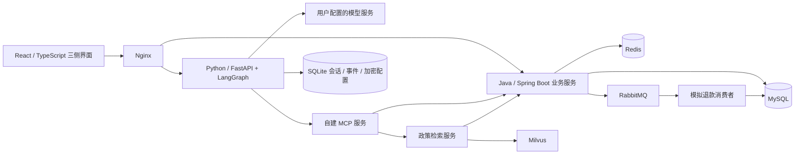

# Aster Commerce · 星序

**把商品选购、订单服务与受控 AI 助手连接起来的零售应用。**

Aster Commerce 是面向工程实践的单商家项目，基于 [macrozheng/mall](https://github.com/macrozheng/mall) 的商品、会员和订单能力，新增客户/客服/管理员界面、Agent 工具链、政策检索、人工咨询、异步模拟退款与订单履约。

项目关注的不只是“让模型回答问题”，也包括谁有权读写数据、哪些操作必须确认、知识更新后答案是否仍然有效、重复消息如何处理，以及如何用证据描述结果。

**状态：V1 本地业务验收已完成，公开交付准备中。** 支付、商品、配送和政策使用合成数据或模拟流程；不是可直接上线经营的商用系统。没有宣称独立盲测准确率、生产容量或任意环境的一键部署成功。

[快速开始](docs/getting-started.md) · [文档导航](docs/README.md) · [系统架构](docs/architecture.md) · [验收证据](docs/testing.md) · [公开发布检查](docs/public-release.md)

## 功能

| 使用者 | 已实现的主要能力 |
|---|---|
| 客户 | 登录注册、商品分类/搜索/分页、购物袋、下单与模拟支付、物流查看与确认收货、售后申请、人工咨询 |
| 客户与 AI 助手 | 流式对话、个人模型连接、商品/订单工具、政策引用、受控售后预览与确认、会话内任务上下文 |
| 客服 | 售后领取与审核、异步模拟退款监控及只读对账、人工咨询领取/回复/解决 |
| 管理员 | 员工角色、政策发布/修订/撤回、商品上下架、SKU库存调整与记录、模拟发货/派送 |

### 工程重点

- **后端执行业务授权。** 客户数据按登录身份隔离，员工操作检查当前角色；模型不能自行决定身份或退款权限。
- **有副作用的 Agent 操作需要确认。** Java保存售后预览、有效期与确认状态，执行时重新校验；模型不能绕过客户确认提交。
- **检索与权威数据分离。** MySQL维护已发布政策；BM25与Milvus召回经RRF融合、Rerank精排，回答前复核版本与来源。索引不可用时明确降级。
- **交易与异步处理各有边界。** 原子库存占用；事务Outbox、RabbitMQ、重试与幂等模拟退款账本。消息确认不等于退款完成。
- **可观察、可复核。** 工具执行进度与最终回答分开展示；保留失败和复测，区分检索指标、契约检查与答案质量。

## 架构概览



Java负责业务规则和权威数据，Python负责Agent编排与检索，TypeScript负责交互。当前是本地多进程/容器部署，不描述为已经完成治理的微服务平台。详见[系统架构](docs/architecture.md)。

| 层次 | 技术与用途 |
|---|---|
| 前端 | React、TypeScript、Vite、SSE、React Markdown |
| 业务 | Java 17、Spring Boot、Spring Security、MyBatis、Spring JDBC |
| Agent | Python 3.12、FastAPI、LangGraph、LangChain Core、MCP Python SDK |
| 检索 | BM25、Milvus、RRF、BGE嵌入与交叉编码精排（CPU） |
| 存储/消息 | MySQL、Redis、RabbitMQ、SQLite；MongoDB保留上游依赖 |
| 运行/测试 | Docker Compose、Maven、pytest、Playwright |

版本以仓库中的Maven配置、npm/Python lockfile与Compose镜像声明为准，不依赖“安装最新版”。

## 快速开始

已验证的开发工作流为 **Windows + PowerShell 7 + Docker Desktop Linux容器 + Node.js 24**。Java/Maven和Python依赖在容器内运行。其他操作系统尚未单独验收。

```powershell
git clone https://github.com/GRIZ200005/aster-commerce.git
Set-Location aster-commerce
```

仓库仍为私有时，克隆需要访问权限。**首次运行须按[完整安装步骤](docs/getting-started.md)准备检索镜像、固定模型缓存和合成数据**；仅执行下面的启动命令不能替代这些前置步骤。

已有前置资源后：

```powershell
./scripts/start-p2.ps1 -Build
```

打开 [本地首页](http://127.0.0.1:18030)。客户可自行注册；管理员/客服凭据由本机初始化生成，位于忽略提交的 `.local/p1-accounts.json`，不要上传或分享。

| 页面 | 路径 |
|---|---|
| 客户选购 / AI助手 | `/app` / `/app/assistant` |
| 个人模型设置 | `/app/settings?tab=models` |
| 订单 / 人工咨询 | `/app/orders` / `/app/support` |
| 客服售后 / 人工咨询 | `/service` / `/service/support` |
| 管理中心 / 商品 / 履约 | `/admin` / `/admin/products` / `/admin/orders` |

模型连接支持DeepSeek、OpenAI、Kimi及自定义Chat Completions兼容服务。所选模型还需支持工具调用与流式接口。密钥在个人设置中填写，加密保存在服务端；基础商城、客服与管理员流程不需要模型密钥。

## 数据与验证

- 原创合成目录：100件扩展商品、10个分类、100张AI生成配图；初始化另含少量基础商品。
- 政策库：80份客户政策、16份员工SOP，共288条编写条款；员工SOP不进入客户检索。这些是模拟服务规则，不是其他商家的真实政策或法律意见。
- 2026-09-16验收：13项业务用例均有通过证据，其中1项修正旧测试假设后复测通过；4项真实MCP/在线检索检查通过。
- 真实模型开发实验与离线检索比较另有记录；契约通过不是答案准确率，开发集不是独立测试集。

固定业务验收：

```powershell
Set-Location apps/web
npm run test:v1
```

测试需要已启动服务与已导入数据，会生成合成账号和订单。前提与证据口径见[验证指南](docs/testing.md)、[本轮验收记录](docs/34-v1-acceptance.md)。

## 目录

```text
apps/web/                   三侧界面与浏览器测试
services/commerce/          mall衍生模块与原创Aster业务模块
services/agent/             Agent、MCP、会话、模型连接与测试
services/retrieval/         在线政策索引和检索服务
deploy/                    Compose、Nginx、配置、SQL迁移
catalog/                   合成商品目录、配图清单
knowledge/                 政策草案、条款目录与手册
evaluation/                题集、实验配置、审核后的结果摘要
scripts/                   构建、启动、导入、验证工具
docs/                      当前工程指南与有日期的阶段记录
```

## 已知边界与后续

当前不含真实支付/快递、第三方电商MCP、网络搜索、跨会话长期画像、多商户、多仓库或生产集群部署。商品查询使用MySQL关键词/过滤，不宣称商品语义检索。政策索引为单worker；Agent的SQLite持久化在横向扩展前也需要重新设计。

后续优先完成全新环境复现与已有链路学习，见[工程贡献与路线](docs/engineering-guide.md)。默认Compose仅供本机开发，不应直接暴露到公网。

## 贡献、安全与许可证

- 改动与问题反馈：[CONTRIBUTING.md](CONTRIBUTING.md)。
- 凭据、数据隔离及漏洞报告：[SECURITY.md](SECURITY.md)。
- 本项目原创代码与文档采用 [Apache License 2.0](LICENSE)。mall衍生代码保留原作者及原协议；其他依赖、模型、资源遵循各自许可证。
- 上游固定提交、修改范围和资源来源见 [THIRD_PARTY_NOTICES.md](THIRD_PARTY_NOTICES.md)。不宣称商城底座从零自研，仓库公开也不替代第三方资源再分发许可核对。
