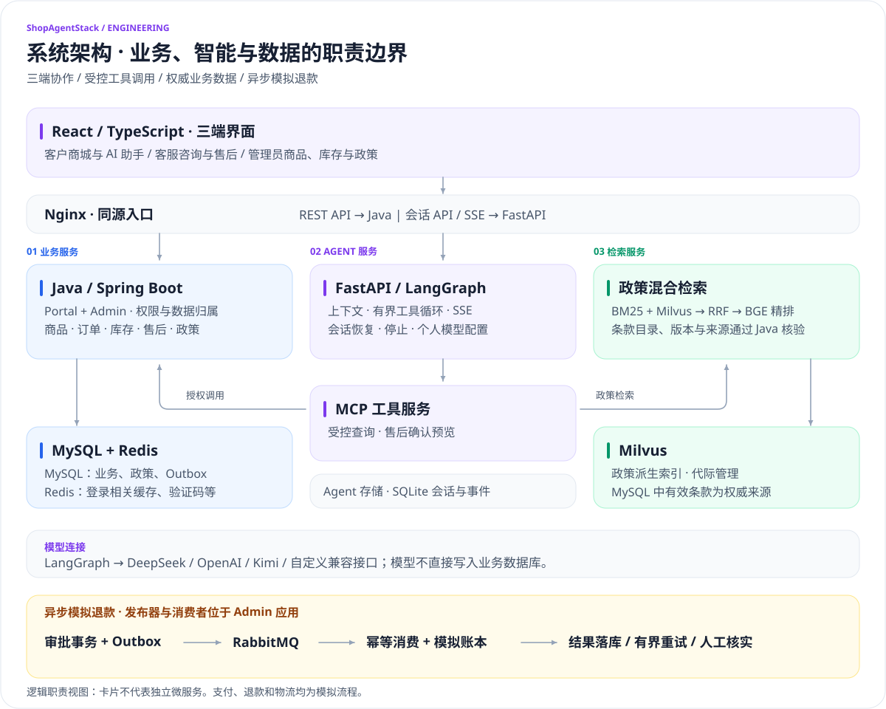
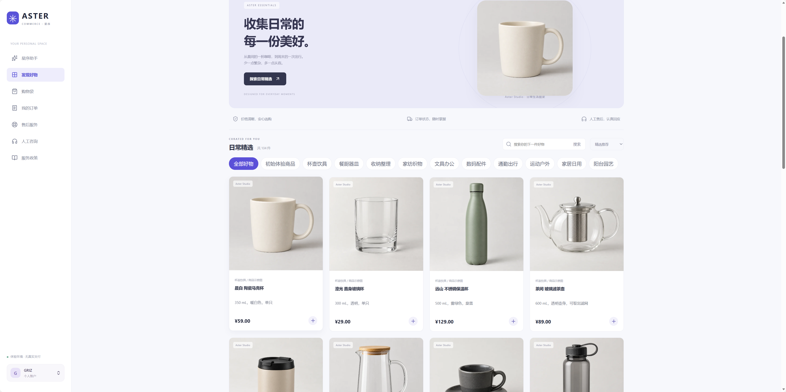
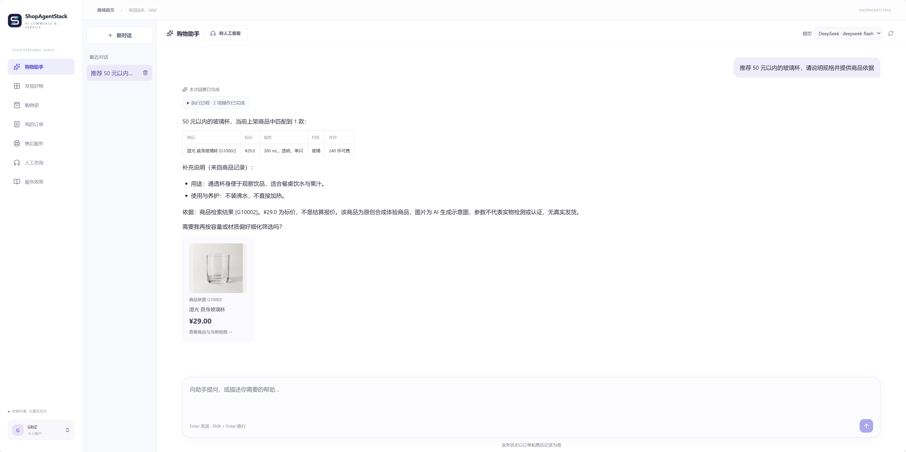
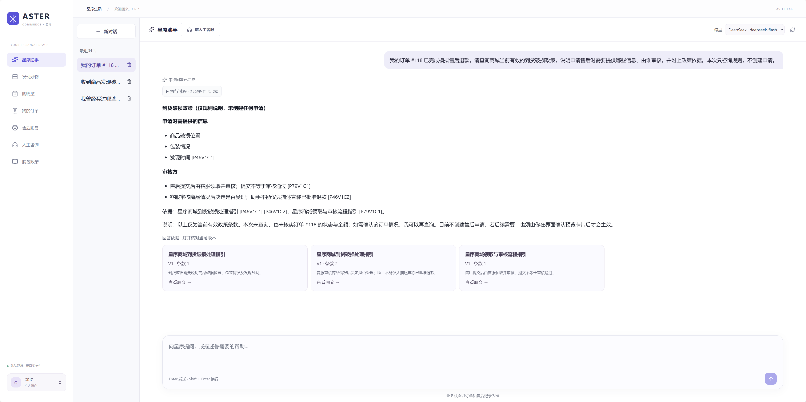
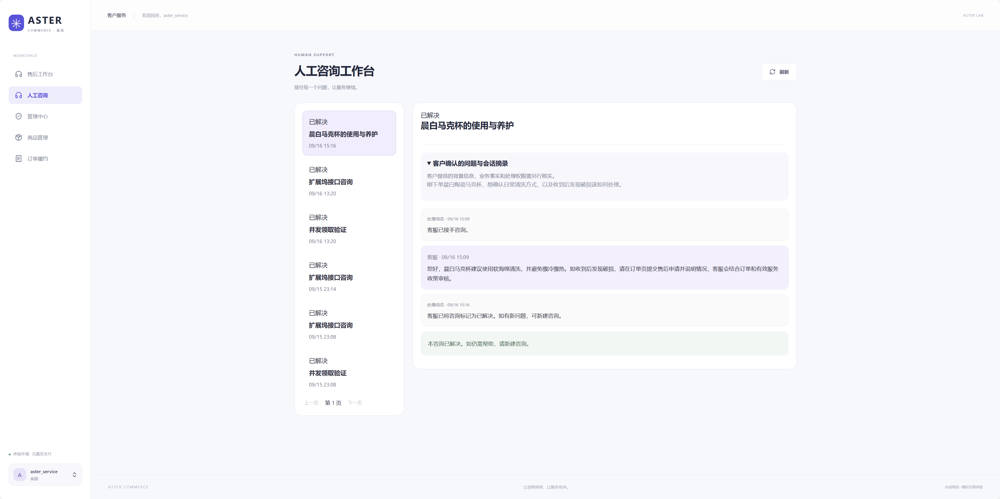
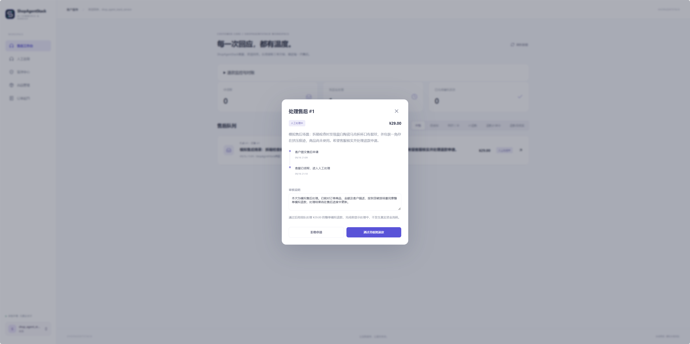
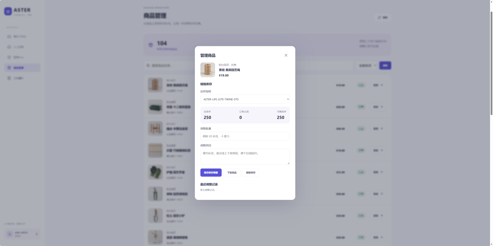
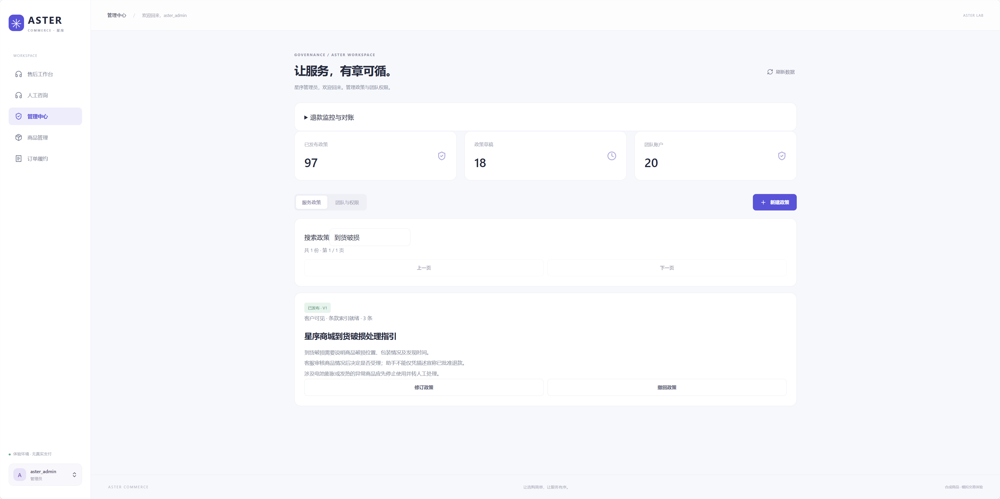
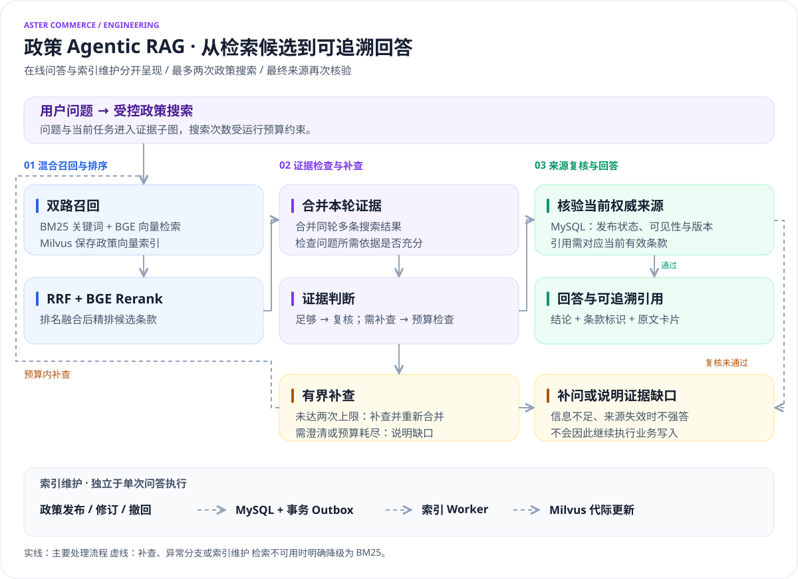

<div align="center">

# Aster Commerce · 星序

**个人开发的 AI 电商与客户服务项目 · 从智能问答到可追踪的业务执行**

[项目实现](#项目实现与个人贡献) · [产品展示](docs/showcase.md) · [快速开始](docs/getting-started.md) · [系统架构](#系统架构) · [工程文档](docs/README.md)

</div>

Aster Commerce · 星序是一个个人开发与维护、基于 [macrozheng/mall](https://github.com/macrozheng/mall) 二次开发的 AI 电商与客户服务项目。项目围绕「选购 → 下单 → 履约 → 咨询 → 售后」构建客户、客服、管理员三端协作流程，覆盖需求设计、前后端实现、Agent 编排、知识检索、容器化运行与自动化验证。

项目采用 **Java / Spring Boot** 承载业务与权限控制，**Python / FastAPI / LangGraph** 编排 Agent，**React / TypeScript** 构建前端，并结合 **MySQL、Redis、RabbitMQ 和 Milvus**，实现政策混合检索与引用、客户确认、异步模拟退款及自动化验证。**MCP** 连接受控业务工具，**Docker Compose** 管理本地服务环境。

客户可以通过 AI 助手筛选商品、核实规格、查询订单和理解售后政策，再通过确认卡片发起业务操作；客服承接人工咨询与售后审核，管理员维护商品、库存和政策。后端持有身份、价格、库存与状态的最终决定权，对模型发起的业务操作进行校验并留存记录。

项目使用原创合成商品和服务政策，支付、退款及配送均为模拟流程。基础交易与客服流程可独立运行；AI 功能通过个人模型连接启用。

## 项目实现与个人贡献

商城基础来自 mall；本项目在保留上游来源和协议的基础上，新增三端交互、AI 服务及下列业务能力。实现归属和上游修改分别记录于[工程实现与归属](docs/engineering-guide.md)与[第三方来源声明](THIRD_PARTY_NOTICES.md)。

| 方向 | 本项目新增或改造的内容 | 关键设计 |
|---|---|---|
| 三端业务 | 客户商城、客服咨询与售后工作台、管理员商品与政策管理 | 角色与数据归属校验、领取人权限、操作审计 |
| 交易与库存 | 改造上游下单校验，新增库存调整与模拟履约 | 权威价格、事务、锁顺序、条件更新、幂等事件 |
| 异步售后 | 新增审批后的模拟退款投递、消费与核对 | 事务 Outbox、RabbitMQ、幂等账本、有界重试与人工核实 |
| AI 应用 | 新增模型适配、LangGraph 工具循环与 MCP 业务工具 | 上下文预算、执行授权、确认预览、SSE 与会话恢复 |
| 政策知识库 | 新增条款版本管理、索引更新和有界证据检查 | BM25 + Milvus、RRF、BGE 精排、发布可见性与引用复核 |
| 工程交付 | 新增合成数据、导入脚本、容器配置和分层验证 | 固定版本、可追溯实验记录、浏览器/API 验收与故障测试 |

**开发方式**：本项目由个人发起与维护，开发过程中使用 Codex 等 AI 编程工具辅助方案讨论、代码实现、问题定位、测试与文档整理。维护者负责需求取舍、变更验收与持续维护；实现范围、上游来源及验证结果以仓库代码和工程记录为准。

建议从[一次 Agent 查询](docs/agent.md)、[一次交易与异步退款](docs/architecture.md)、[验证记录](docs/testing.md)三个入口阅读，结合下方真实运行截图查看实现效果。

## 系统架构

[](docs/assets/diagrams/system-architecture.svg)

图中按职责组织模块，不表示每个节点都是独立部署的微服务；退款发布器与消费者运行在 Admin 应用内。图中省略部分交叉调用，按卡片和连线说明阅读；完整请求与索引维护链路见工程文档。Java 持有业务事务，Agent 不直接修改业务数据库；检索发布链路详见[系统架构文档](docs/architecture.md)。

| 层次 | 技术与职责 |
|---|---|
| 交互 | React、TypeScript、Vite、SSE、React Markdown |
| 业务 | Java 17、Spring Boot、Spring Security、MyBatis、Spring JDBC |
| Agent | Python 3.12、FastAPI、LangGraph、LangChain Core、MCP SDK |
| 检索 | 中文 BM25、Milvus、RRF、BGE Embedding / CrossEncoder（CPU） |
| 存储与消息 | MySQL、Redis、RabbitMQ、SQLite；MongoDB 为上游依赖 |
| 交付与验证 | Docker Compose、Maven、pytest、Playwright、Node.js 测试 |

Java 持有业务规则与权威数据，Python 处理模型编排与检索，TypeScript 呈现交互。依赖版本以 Maven、lockfile 和 Compose 配置为准。

## 产品展示

点击角色标题展开截图，客户侧默认展开。[查看完整图集](docs/showcase.md)。

<details open>
<summary><strong>客户侧 · 商城、智能助手与政策问答</strong></summary>

**商城与商品目录** — 分类、搜索与日常精选。



**商品问答** — 条件查询、规格核实与商品依据卡片。



**政策问答** — 回答中的条款标识与可查看原文的来源卡片。



[更多客户侧截图](docs/showcase.md#customer)

</details>

<details>
<summary><strong>客服侧 · 人工咨询与售后审核</strong></summary>

客户背景、咨询消息、处理动态与解决状态集中展示。



售后领取后填写审核说明，处理结果通过时间线同步给客户。



[更多客服侧展示](docs/showcase.md#service)

</details>

<details>
<summary><strong>管理员侧 · 商品运营、规格库存与履约</strong></summary>

查看规格的总库存、订单占用与可售库存，按数量及原因提交调整。



管理正式服务政策，查看发布版本和条款索引状态。



[更多管理员侧截图](docs/showcase.md#admin)

</details>

截图来自本机运行的合成业务环境。完整图集包含模拟发货、收货及售后处理结果；本地体验方式见[快速开始](#快速开始)。

### 推荐体验流程

1. **智能选购**：客户浏览商品，向助手询问「推荐 50 元以内的玻璃杯」，查看检索结果、规格说明与商品卡片。
2. **交易履约**：加入购物袋、下单并模拟支付；员工在订单履约页模拟发货，客户查看配送动态并确认收货。
3. **政策问答**：询问「收到商品发现破损，申请售后需要提供什么信息、由谁审核？只查询规则，不创建申请」，查看政策条款和原文引用。
4. **人机协作**：客户确认提交咨询或售后申请，客服领取、回复或审核，客户查看处理时间线；模拟退款由异步流程完成。
5. **运营管理**：管理员调整 SKU 库存，查看审计记录，发布或修订政策并观察索引状态。

以上是本地交互路径，截图折叠区域用于浏览展示；启动与角色账户说明见[安装指南](docs/getting-started.md)。

## 功能地图

| 客户空间 | 客服工作台 | 管理中心 |
|---|---|---|
| 登录注册、账户与模型设置 | 售后领取、审核与拒绝 | 员工角色管理 |
| 分类、搜索、分页与商品详情 | 异步模拟退款进度 | 商品上下架、SKU 库存调整 |
| 购物袋、下单与模拟支付 | 退款重试与只读一致性核对 | 库存调整原因与审计记录 |
| 订单、配送与确认收货 | 人工咨询领取、回复与解决 | 订单查询、模拟发货与派送 |
| Agent 问答、政策引用与售后预览 | 客户背景信息与处理动态 | 政策发布、修订、撤回与索引状态 |

## 核心实现

### 受控 Agent 与业务工具

FastAPI 接收会话请求，LangGraph 组织有界工具循环，自建 MCP 连接 Java 业务服务。订单与售后查询按登录客户隔离；商品工具从数据库读取可售规格；售后写入必须经过客户显式确认。

- **模型连接**：DeepSeek、OpenAI、Kimi 与自定义 Chat Completions 兼容服务；模型列表选择、连接测试、服务端加密存储密钥。
- **上下文管理**：有界历史、会话任务快照、宿主管理的商品引用；价格、库存和订单状态重新读取。
- **执行体验**：SSE 进度、可折叠工具记录、Markdown 回答、来源与业务卡片、停止及事件恢复；支持确认后删除个人对话。
- **运行约束**：工具白名单、短期执行授权、轮次与用量阈值、失败保留；来源校验通过后才发布有依据的回答。

详见 [Agent 与上下文设计](docs/agent.md)。

### 有版本的政策 Agentic RAG

[](docs/assets/diagrams/policy-agentic-rag.svg)

点击图片查看矢量大图。蓝色表示检索，紫色表示证据编排，绿色表示来源复核与回答，琥珀色表示补查或证据缺口。索引维护单独列出，避免与单次问答流程混淆。

政策发布与索引任务使用事务 Outbox。MySQL 保存权威条款，Milvus 保存派生索引；检索按可见性、版本和代际约束，索引不可用时明确降级。同轮多条搜索先合并证据再统一核查，整个运行最多执行两次政策搜索。最终回答再次复核政策来源；模型的语义判断与来源一致性分别验证。

### 交易一致性与异步业务

| 问题 | 实现机制 |
|---|---|
| 并发下单、管理库存竞争 | 商品 → SKU 锁顺序、条件更新、原子占用与事务回滚 |
| 重复点击、响应丢失后重试 | 请求标识、后端确认记录与状态检查 |
| 审批已提交、消息暂时未送达 | 同事务写业务状态与 Outbox，后台有界重试 |
| 重复退款消息 | 幂等消费、唯一模拟账本、业务结果同事务提交 |
| 重试耗尽 | 转入人工核实，保留错误与处理记录 |
| 客服并发领取 | 行锁与领取人权限，禁止其他员工代回复或处理 |
| 配送重复提交 | 订单锁、唯一配送阶段事件、客户归属检查 |

退款账本与业务库共享本地事务；该实现没有连接真实支付网关。设计及限制见[系统架构](docs/architecture.md)。

## 快速开始

开发工作流：**Windows + PowerShell 7 + Docker Desktop Linux 容器 + Node.js 24**。Java/Maven、Python 与检索模型在容器中运行。

```powershell
git clone https://github.com/GRIZ200005/aster-commerce.git
Set-Location aster-commerce

# 准备检索镜像与固定版本模型缓存
docker compose -f deploy/compose.retrieval.yml build evaluation
docker compose -f deploy/compose.retrieval.yml run --rm --no-deps evaluation python scripts/prepare-retrieval-models.py

# 构建应用、执行迁移并启动服务
./scripts/start-p2.ps1 -Build

# 导入原创合成商品与发布服务政策
node scripts/import-product-catalog.mjs --apply
node scripts/import-policy-library.mjs --publish
```

打开 **[http://127.0.0.1:18030](http://127.0.0.1:18030)**。客户可以注册；客服与管理员使用本机初始化账户。AI 连接在客户空间的“模型设置”中配置，不需要把 Key 写入源码。

首次运行的依赖顺序、失败处理、账户位置与数据冲突处理见[安装指南](docs/getting-started.md)。启动脚本保留现有卷；默认 Compose 仅绑定本机入口。其他操作系统和全新机器的完整复现尚未单独验收。

## 数据与验证

| 数据 | 内容 |
|---|---|
| 商品目录 | 100 件原创扩展商品、10 个分类、100 张独立 AI 配图；另有基础种子商品 |
| 政策库 | 80 份客户政策 + 16 份员工 SOP，共 288 条编写条款；员工材料不进入客户检索 |
| 业务夹具 | 合成用户、订单、咨询、售后和配送记录 |
| 评测材料 | 检索对照、Agent 契约、历史/任务状态消融、故障与只读性能实验 |

固定业务验收入口：

```powershell
Set-Location apps/web
npm run test:v1
```

已有验证证据按类型保留，便于从页面效果进一步核查业务与工程行为：

| 验证范围 | 已记录结果 | 证据入口 |
|---|---|---|
| 三端业务验收 | 13 项业务有通过证据，其中 1 项修正测试假设后复测通过 | [固定验收](docs/records/34-v1-acceptance.md) |
| 工具与检索集成 | 4 项真实 MCP / 在线检索检查通过，经过实际业务服务与本机检索链路 | [固定验收](docs/records/34-v1-acceptance.md) |
| Agent 与交互回归 | 33 项聚焦后端回归、2 项浏览器回归通过 | [Agent 与展示回归](docs/records/35-showcase-and-agent-regressions.md) |
| 检索与模型实验 | 已记录离线检索比较、真实模型开发实验及多轮上下文消融 | [测试与指标口径](docs/testing.md) |

上述数字来自对应日期和版本的记录，不合并为统一通过率。**契约通过率、检索指标和答案准确率分别统计**；确定性回归与单次成功截图不代表真实模型的整体回答准确率。实验保留首轮失败、修正与定向复测，完整条件见各记录。

## 目录与源码导航

```text
apps/web/              客户、客服、管理员界面与页面测试
services/commerce/     mall 衍生模块与 Aster 业务服务
services/agent/        模型适配、Agent、MCP、上下文与会话存储
services/retrieval/    政策索引、混合召回与精排
deploy/                Compose、Nginx、配置与 SQL 迁移
catalog/               商品目录、图片及来源清单
knowledge/             政策编写源、条款目录与手册
evaluation/            题集、实验配置与结果摘要
scripts/               构建、启动、导入与验证工具
docs/                  架构、API、运维、验证与展示
```

[工程实现与归属](docs/engineering-guide.md) · [代码结构与维护](docs/maintainability.md) · [API 导航](docs/api.md) · [运维指南](docs/operations.md)

## 适用范围

项目面向单商家合成业务。未接入真实支付/快递、第三方商家 MCP、网络搜索或跨会话长期画像。商品查询使用 MySQL 关键词与过滤；政策索引为单 worker，Agent 使用 SQLite 持久化，多实例扩展需要额外设计。不将本机功能验收描述为生产容量、高可用或独立盲测准确率。

## 贡献与许可证

欢迎围绕具体问题提交改进，流程见 [CONTRIBUTING.md](CONTRIBUTING.md)，安全问题见 [SECURITY.md](SECURITY.md)。

原创代码与文档采用 [Apache License 2.0](LICENSE)。商城基础来自 **macrozheng/mall**，保留上游许可证、作者与修改声明；依赖、模型和素材遵循各自许可。固定上游提交及增量范围见 [THIRD_PARTY_NOTICES.md](THIRD_PARTY_NOTICES.md)。
