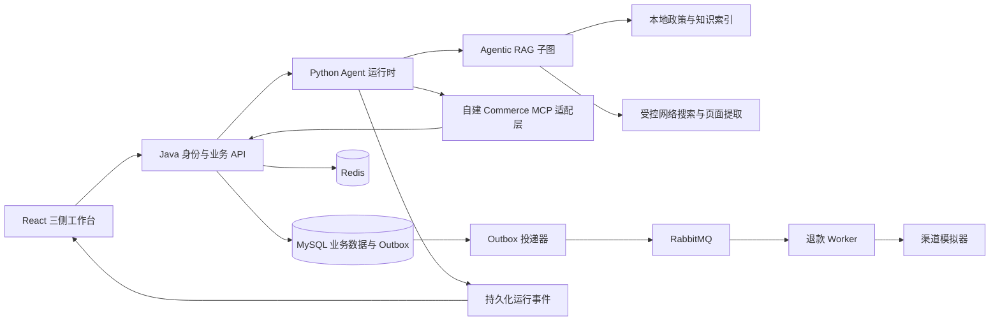
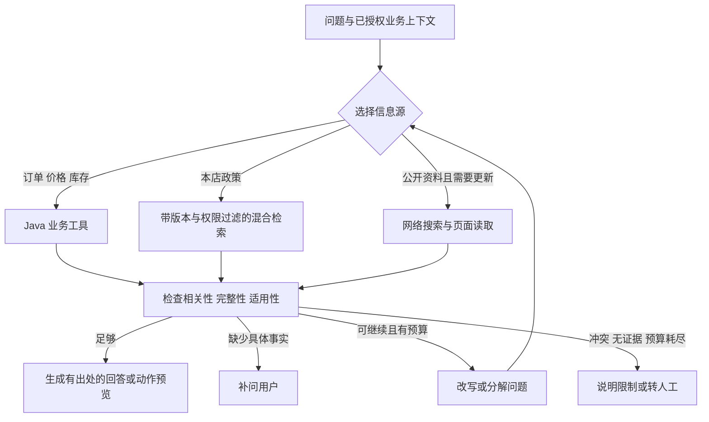

# Aster Commerce v1.0 最终项目计划

> 阶段记录：保留当时的方案、结果与限制，不代表当前全部状态。安装和当前能力以[工程文档首页](README.md)为准；后续更新不改写此处原始实验结论。

日期：2026-09-14。本文描述完整目标版本；P0 及 P1 首个三侧业务闭环已实施，实际验收与剩余范围见 07、08 文档。下文的完整 Agent、可靠退款和评测架构仍是后续目标。

## 1. 定位与选型

名称：**Aster Commerce · 星序**。中文描述：**智能交易与客户服务平台**。代码目录：Aster-Commerce。名称用于当前项目，不宣称商标或域名独占。

用户价值：客户通过自然语言及可操作商品、订单卡片完成选购咨询与售后；客服通过统一待办处理异常；管理员控制权限、政策、连接器和运行质量。

业务底座选择 [macrozheng/mall](https://github.com/macrozheng/mall) 的 Spring Boot 版本，固定通过本地验证的提交。复用会员、商品、订单及管理基础，新增售后领域、可靠退款执行和 Agent 接入。上游功能不得计入自研贡献，也不预设其所有实现生产可靠。

Java/Spring Boot 负责业务事实；Python/LangGraph 负责 Agent；React/TypeScript 负责新的三侧工作台。第一版不引入新的 Node Agent 运行时，不移植通用桌面助手，也不使用 mall-swarm 作为起步底座。

## 2. 最终版功能范围

### 客户侧 `/app`

- 登录、账户、自己的订单与售后。
- 商品浏览、搜索、规格筛选、商品对比与本店可售推荐。价格、库存以业务 API 即时结果为准。
- 购物车与简化结算，支付使用沙箱模拟；订单来源可由页面实际生成。
- 带证据的政策问答；必要时通过网络查询公开的商品说明或品牌资料。
- 操作预览卡、明确确认、售后提交、退款进度、转人工。
- 对话历史、来源侧栏、断线恢复、运行停止；停止 Agent 不等于撤销已提交业务。

### 客服侧 `/service`

- 待办队列、分派/领取、优先级、内部备注、待确认/审核/异常任务。
- 订单、售后、相关对话和已发布政策的上下文面板。
- AI 回复草稿、证据查看、人工修订并发送；不默认自动发送人工名义的回复。
- 审核、拒绝、补问、人工接管、结果核实；主管通过权限控制高额审核。
- 同一工单领取采用原子状态转换；接管状态阻止 Agent 继续自动写入。

### 管理员侧 `/admin`

- 用户、客服角色、菜单与业务数据权限。
- 商品/订单基础管理可在早期使用上游页面，最终日常核心入口统一进新界面。
- 政策草稿、审核发布、版本、生效期、撤回、索引状态。
- MCP/搜索连接器配置、健康状态与权限范围；密钥不下发浏览器。
- 退款失败与待核实队列、重试/对账、审计、错误率、延迟、模型成本。
- 评测运行与报告查看，生产运行与测试数据明确分开。

三侧可以共享一个 React 应用和设计系统，按路由与授权分区。前端隐藏菜单不是权限实现，Java 每次都校验角色和资源归属。单商家不等于单用户；第一版必须具备多用户隔离。

## 3. 客户侧视觉与交互

采用对话与业务内容结合的工作台，不将工程 trace 作为客户首页。

桌面默认布局：左侧 224px 导航（首页、选购、订单、售后、历史）；中央自适应内容区（首页/商品网格/对话）；右侧 360–420px 详情区按需展开（商品对比、订单、政策来源）。窄屏右侧变抽屉，导航收起，不强制三栏挤在手机屏幕。

视觉：中性浅色基底、深色文字、靛蓝主色、克制阴影、统一间距和圆角；商品图与证据内容优先。深色主题可在基础体验验收后加入。语义颜色、字体、间距、层级通过 design tokens 管理，具体数值由新项目自行设计。

主要组件：ProductCard、ProductCompare、OrderCard、ActionPreview、ConfirmationCard、RefundTimeline、SourceCitation、HandoffStatus、ConnectionBanner。由受约束 JSON schema 渲染白名单组件，模型不生成任意可执行 HTML。

状态展示：正在查订单、正在查政策、需要确认、已提交、处理中、结果待核实、已完成。只展示真实事件和简短执行摘要，不展示模型隐藏推理、内部提示词或原始凭证。

确认卡必须显示对象、动作、退款金额/商品项、有效期与结果影响。成功卡必须由持久化业务状态支撑，不能由模型文字或前端动画宣布成功。

客户可在商品网格和自然语言选择之间切换，不强迫所有操作经过聊天。客服采用队列/会话/业务详情布局；管理员采用列表/筛选/表单/指标布局，共享同一视觉体系。

## 4. 系统架构

Java 基线候选：JDK 17 + Spring Boot 3.5 + MyBatis + Spring Security，最终以固定上游提交的兼容性验证为准。数据库 MySQL、缓存 Redis、队列 RabbitMQ。Python 锁定 FastAPI/LangGraph/FastMCP 依赖；检索先保留 Milvus/BM25/RRF/重排。MinIO/etcd 仅在确有组件依赖时启动并如实标注用途。

保持上游 admin/portal 应用结构，新增售后共享领域模块，初期不做大规模上游合并/拆分。Python 不修改业务表。Agent 运行记录可以使用单独逻辑 schema；业务事实与工具授权归 Java。Java 调用 Agent 后释放短事务，禁止长时间模型调用持有数据库锁。

统一标识：user_id、session_id、run_id、event_id、tool_call_id、trace_id、operation_id。服务端签发有限作用域的执行上下文，模型不能修改身份；MCP 适配器验证调用方，Java 再校验客户归属或客服范围。服务凭据本身不授予所有订单权限。

服务入口先 POST 创建运行返回 run_id，再订阅 GET SSE 事件；事件序号、持久化快照和重放接口用于恢复。授权使用受控同源会话或短期 stream ticket，不能把长期访问令牌放在 URL。token delta 分批存储，业务终态事件持久化后才广播。

## 5. 真正的 Agentic RAG

Hybrid RAG 说明召回方式；Agentic RAG 说明系统会根据证据动态决定下一步。使用 LangGraph 构建有界子图，而非每次固定检索一次然后生成回答。[官方检索 Agent 示例](https://docs.langchain.com/oss/python/langgraph/agentic-rag)

候选预算：最多 3 轮证据检索、每轮最多 2 个独立查询、最多 8 次工具调用；另设 wall-clock 与 token 预算。具体参数在实验后校准，预算用尽必须进入确定终态。简单订单查询走快速路径，不强制调用检索评价模型。

证据充分性结合结构化必需字段、条款版本、来源范围和模型相关性评估；不把模型自报置信度当作校准概率。对金额和资格的最终执行判断来自 Java 确定规则。检索评价失败不能放宽权限。

例子：客户询问“已收货、拆封的配件能否退货，邮费谁承担”。先获取已授权订单的品类和收货时间，再查适用退货与运费条款；若只找到退货条款，补查运费；若缺少拆封状态，补问。对本店政策缺失不去搜另一家店的条款补答案。

记忆用于已知偏好和对话上下文，不能作为当前身份、授权、库存或政策的权威来源。上下文压缩保留 operation_id、待确认动作引用和工具结果配对，恢复执行前从 Java 重读业务状态。

## 6. 网络搜索

v1.0 包含一个真实可配置搜索 provider 接口和页面提取工具；具体供应商在接入时根据可用性与成本验证。支持无密钥离线回归 profile，但最终联网验收需要一次真实 provider 调用及可核对引用，不能将固定结果称为真实联网。

允许用途：品牌公开说明、型号规格、公开服务信息。默认优先官方来源，记录 URL、抓取时间、引用片段与来源类型。外部搜索结果不覆盖本店合同政策、实时价格、库存或订单状态。

订单号、姓名、地址、手机号等不得进入外部搜索 query。页面读取限制公共 HTTP(S)、响应大小、时间和重定向；阻止本机、内网及云元数据地址，解析和重定向阶段均校验。页面内容视为数据，不能改变工具权限。

联网结果保留可重放 fixture，日常评测采用固定快照，真实联网另跑 smoke 测试并标明日期。

## 7. MCP

**自建业务 MCP 是 v1.0 正式能力。** 使用常驻 Streamable HTTP，至少实现 initialize、tools/list、tools/call 的 SDK 标准交互，不把普通 REST 改个名字当 MCP。[协议传输说明](https://modelcontextprotocol.io/specification/2025-11-25/basic/transports)

建议工具：search_products、compare_products、get_my_order、get_after_sale、preview_after_sale、submit_after_sale、get_operation_status。工具参数白名单、JSON schema、读写分类、服务端授权、超时、审计齐全。

连接复用、工具发现缓存、断线重建可采用成熟 SDK；身份不能藏在共享 MCP session 的可变字段里，每次调用都要绑定请求级授权上下文。工具注解不代替可信注册表中的权限分类。

读工具可有限重试。写工具必须带稳定 operation_id / idempotency_key；网络超时进入结果待核实，再按键查询。即使连接重建，也不能无条件重发写动作。禁止回退到 Python 本地写库。

**第三方电商 MCP 是可选扩展，不阻塞 v1.0。** 官方平台确有 MCP 创建文档和收费公告，但尚未核实当前账户能申请什么工具、是否能使用具体店铺数据，因此不承诺直接接入任意商品、个人订单或退款。

- [官方 MCP 创建说明](https://developer.alibaba.com/docs/doc.htm?articleId=122222&docType=1&treeId=843)
- [官方 MCP 服务公告](https://developer.alibaba.com/support/announcementDetail.htm?id=25809&source=search)

接入门槛：确认开发者资质/应用、工具目录、授权范围、测试环境与费用；先验证只读商品查询，之后才评估订单工具。社区爬虫或浏览器封装不等于官方接口。未接入时 UI 明示未配置，不用 mock 冒充官方数据。

## 8. 业务可靠性

售后申请、退款任务和 Agent run 是不同状态机。申请示例：待确认 -> 已提交 -> 待审核 -> 已通过/已拒绝；退款示例：待执行 -> 执行中 -> 成功/失败/待核实。停掉对话不会回滚退款，编辑历史消息不会撤销已执行业务。

核心机制：Java 事务 + 条件更新/版本控制 + 唯一约束；Outbox 与业务更新同事务；MQ 至少一次交付，消费者幂等；渠道模拟器支持超时、重复回调、乱序及成功后响应丢失；后台查询/对账使未知结果收敛。

客户确认是业务动作授权；客服接管改变自动执行权。并发客服审核、客户端重试、Agent 重放都必须收敛到同一结果。

## 9. 完成定义

v1.0 必须具备三侧核心页面、沙箱交易到售后闭环、Agentic RAG 的可观察重检索分支、真实网络搜索连接验证、自建真实 MCP、人工接管、失败恢复、可信评测、干净环境部署与贡献清单。

不以第三方账号批准为完成条件；多租户、真实资金、外部平台写操作、通用子 Agent、桌面自动化和 Kubernetes 放在后续版本。

所有能力只有通过对应验收后才能标为已实现。外部条件缺失时如实报告该项未完成，不能因离线 fixture 通过宣称真实联网已通过。
