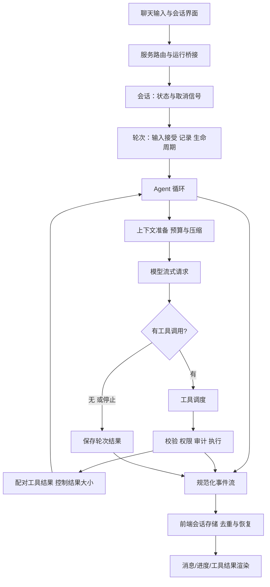

# Agent 运行机制与前端设计研究

日期：2026-09-14。方法：对用户指定的本地参考工程进行静态阅读，沿入口、会话、运行循环、工具、上下文、MCP 和前端事件链路抽查实现；没有启动该工程，也没有运行其测试。以下是机制研究，不是全面代码审计或性能结论。

本文仅记录通用设计及独立实现方案，不包含参考工程的企业名称、部署地址、凭证、专有提示词、行业业务材料或源码片段。没有复制参考工程文件。示意图概括了阅读到的关系，不表示所有运行模式都走完全相同的入口。

## 1. 读取覆盖与整体链路

实际阅读的模块类别：HTTP Agent 路由及 gateway bridge；会话工厂、AgentSession、TurnRunner、AgentLoop；ToolRuntime、并发调度器；ContextRuntime、记忆检索；McpClient/McpRuntime；webSearch/webFetch；前端 Shell、聊天容器、MessagesPane、ToolRenderer、SessionStore、实时事件处理、stream smoother、reconnect recovery 和 design tokens。



### 会话与轮次

观察：会话对象管理 session 状态、turn_id 和 AbortController；轮次执行器记录已接受输入、控制边界、结果，转发循环事件。会话工厂组装工具运行时、调度、上下文及循环，分层职责比较明确。

采用：Aster 分离 Conversation、AgentRun 和 BusinessOperation。会话不等于业务事务；一次 run 可查多个证据，但提交动作归 operation 管理。

需要额外实现：当前读到单个会话 submit 方法不足以证明多实例并发安全。新系统要在服务端明确同一会话的队列或版本冲突处理，并用两个并发客户端验证。

### 模型与工具反馈循环

观察：循环可准备/压缩上下文、流式收集模型输出、提取工具调用、执行、补齐工具结果配对，再继续。代码中有取消、轮次上限、空输出恢复、工具重复失败识别等处理。

采用：使用 LangGraph 节点实现受限反馈循环，保留显式终态与预算，而不另写一个完整通用 Agent 框架。

收窄：文件修复、执行任意命令、桌面操作、通用插件市场不进入电商 Agent。只暴露产品功能需要的工具。

### 工具执行前治理

观察：工具运行时在执行前做 schema/输入验证、生命周期检查、权限决策，再执行工具、截断过大结果并记录审计。相比执行后才显示阻断结果，这一顺序更适合受控写入。

采用：格式校验 -> 请求身份 -> 资源权限 -> 动作确认 -> Java 事务内状态校验 -> 执行 -> 结果核验。每一层都要有可测试的错误类型。

改变：通用工具授权不能替代订单归属和退款资格。模型不能通过修改权限参数扩大访问范围；权限永远由可信服务端决定。

### 并发调度

观察：被标记为 concurrency-safe 的调用先一起执行，其余串行；结果按原始顺序返回。这说明“输出顺序”与“实际执行顺序”可能不同。

采用：独立读操作可以并发，例如公开政策检索与已授权订单查询。

改变：不能只按读写标签重排整个批次。读依赖写结果、多个工具依赖同一对象版本时应保留依赖关系。v1 使用显式节点依赖和小规模有界并发，写操作串行；未来需要时再建 DAG 调度器。

### 上下文与记忆

观察：上下文层具备工具结果预算、压缩、超限恢复等机制。记忆检索先决定是否需要用户/项目记忆，再选择项目/目录项、读取文件并生成上下文，附带 trace 与短期缓存。

判断：这是一种模型参与选择的记忆检索。读取到的链路不能直接证明已实现电商政策的混合召回、条款版本、证据充分性驱动重检索和答案金标评测。

采用：按需取上下文、先筛范围再读取正文、记录为什么选源以及是否命中缓存、控制结果大小。

改变：把身份/项目记忆换成“对话摘要 + 权限范围 + 政策版本 + 可验证业务事实”。摘要不得保存为授权凭据；订单状态在执行前重新获取。摘要与原始消息分别保存，明确来源和更新时间。

### MCP 与网络工具

观察：MCP 客户端支持 stdio 和 Streamable HTTP、连接复用、工具列表缓存、超时处理、会话失效后重连；运行时对启动连接数做限制。网络搜索包装为一个稳定工具，底层可替换 provider。

采用：标准协议、连接生命周期、错误类型、provider 适配、缓存与可观测性。

改变：参考实现某些失效情形会重连后再次调用。电商写操作需要先确认前次结果，不能直接照搬重发策略。HTTP 重试和 MCP 重连都要区分查询与写入，幂等键必须跨重试保持稳定。

## 2. 前端值得学习的机制

| 已观察的机制 | 解决的问题 | Aster 独立实现 |
|---|---|---|
| Shell、聊天容器、消息区分层 | 页面导航与消息渲染职责分离 | 三侧布局组件与共享业务卡片 |
| session/run 维度流式状态 | 切换会话、后台运行容易串消息 | 按 session_id/run_id 分区的状态 reducer |
| 重连后拉取持久化消息并合并 | 连接中断导致消息缺失、重复 | 快照 + event_seq 游标重放 + event_id 去重 |
| 流式文本缓冲与帧调度 | 每个 token 都触发 React 更新 | 帧级批量更新，结束时及时 flush |
| 虚拟消息窗口、动态高度、overscan | 长会话 DOM 过多 | 按实测需要启用虚拟化，保留滚动锚点 |
| 工具渲染注册表与错误边界 | 不同工具结果挤成原始 JSON | 订单/商品/证据/确认组件白名单 |
| 进度分组、可展开执行信息 | 工具事件过多影响阅读 | 客户显示业务摘要，客服可展开诊断 |
| 语义 design tokens | 颜色、间距与主题不一致 | 新视觉规范与共享 CSS tokens |

没有性能实测，不能因出现 memo、虚拟化或 smoother 就宣称“已优化到某个帧率”。参考代码也包含大组件和业务耦合，新工程要提炼职责而不是复制体量。

### 流式正确性设计

- 每个事件具有 event_id、run_id、sequence、type、schema_version、occurred_at。
- assistant_delta 是可合并文本，operation_updated 是服务端业务状态，两者分开。
- 快照记录 last_event_seq，客户端只接续更新，不再拼接已包含的文本。
- 乱序/缺序先补取，重复事件忽略；最终状态优先于残余 loading 标志。
- 重连后重新鉴权和加载快照，不能只相信前端 isProcessing。
- 停止生成后保留已提交 operation_id，显示当前业务状态；重新生成答复不再提交相同业务。
- 文本显示平滑不得拖延确认和终态卡片；尊重减少动态效果偏好。

### 推荐的消息协议

公共事件类型：run_started、status_updated、assistant_delta、sources_updated、ui_card、confirmation_required、operation_updated、handoff_changed、run_completed、run_failed。

客户侧只接收授权字段。原始工具参数、内部错误堆栈与模型诊断进入受限运维视图。结构化卡片字段经服务端 schema 验证，前端禁止执行模型提供的脚本。

## 3. 新实现的代码边界建议

以下是将来实施的目标目录，目前并未生成应用源码：

```text
apps/web/                 React 三侧入口与业务页面
services/commerce/        固定上游版本与新增 Java 售后模块
services/agent/           Python runtime / graphs / retrieval / memory
services/mcp-adapter/     标准 MCP 到受限 Java API 的适配
packages/contracts/      OpenAPI、事件与 UI 卡片 schema
data/                    脱敏/合成样例与 manifest
evaluation/              fixtures、gold labels、runner、reports
deploy/                  Compose profiles
docs/                    当前计划与后续验证记录
```

MCP 适配层可以与 Python 服务共用进程起步，逻辑独立不等于必须新增部署实例。物理部署在 P0 确定并记录。

## 4. 发布与实现边界

借鉴的是会话分层、受控执行、标准事件、预算、连接管理与前端恢复这些通用机制。只在公开许可明确且确有复用必要时引入外部代码并保留归属；本次未迁移任何本地参考代码。

不迁移参考工程的产品名称/标识、内部服务连接、许可系统、企业专用工作流、行业文档、真实账号、固定业务提示词和部署脚本。只替换名称无法保证材料可以公开，因此采用独立设计和实现。

## 5. 对应验收

1. 连续 3 次切换会话，后台 run 仍归属原会话，界面不串消息。
2. SSE 断线并恢复，持久化消息和运行中消息不重复、不丢失。
3. 一段长会话中插入动态高度卡片，滚动锚点稳定；记录固定设备下渲染指标。
4. 工具参数无效/越权时执行器拒绝，数据库没有副作用。
5. 写操作返回超时但实际成功，客户端恢复后显示同一 operation 的结果。
6. RAG 证据不足时确实补查或补问；trace 可证明分支发生，预算耗尽按预期停止。
7. 压缩前后待确认动作一致，最终授权仍由服务端持久化记录校验。
8. MCP 重连不会产生第二笔退款；只读工具连接重建可恢复。
