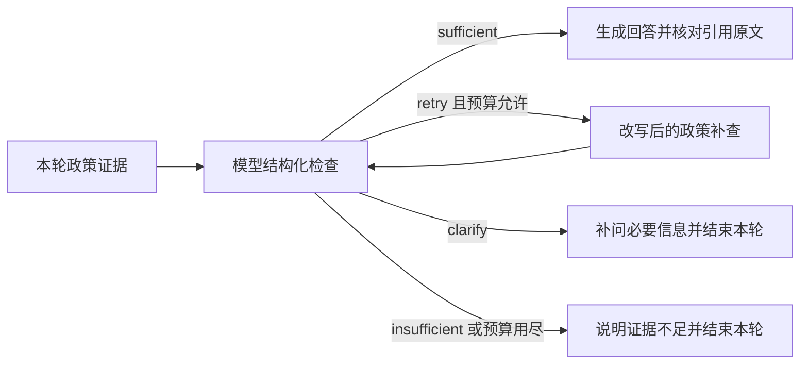

# P3d 政策证据检查、补查与补问

## 本轮实现

在实际 `search_policies` 调用之后接入独立的 LangGraph 子图：

这不是把现有工具循环改名为 Agentic RAG。子图实际有条件边与一次补查节点，但仍是初步有界流程，不包含网络搜索、复杂规划、反复自我反思或完整答案蕴含验证。

## 判断输入与约束

检查器使用当前账户已选择的模型连接，读取本轮问题、最近至多六条用户/助手文字上下文和实际检索条款。历史回答属于上下文，不是有效政策来源。检查请求不开放业务工具，不流式输出检查正文。

返回结构为 decision、evidence_ids、missing_fields、query。充分回答必须提供本轮存在的证据 ID；未知 ID、错误 JSON、非法补问字段均不能授权生成。无效检查单独提示“未能完成证据核查”，不把模型格式错误解释成没有政策。

补问只允许订单、商品型号、使用情况、原因、时间五种字段，由系统固定文字生成问题，不索取密码、Key、姓名、地址或私人电话。补查 query 限制 500 字，并拒绝 URL、邮箱、常见 Key 前缀和连续六位以上数字；这是保守的基础校验，不是完整个人信息识别器。

## 预算与执行结果

- 整个 run 最多两次政策检索，包含模型请求的首次检索和子图补查。
- 子图最多一次补查、两次检查。预算耗尽后不再循环改写。
- 继续保留 8 次工具调用、4 次外层模型轮次、90 秒总超时，以及按服务商报告用量计算的 8000 token 门槛。服务商不返回用量时，token 计数并非可靠硬限制；时间与调用次数仍有效。
- 后续商品 Agent 阶段将累计报告门槛调整为 16000，见 [当前预算与验证](29-product-agent-live-evaluation.md)；8000 为本阶段的历史配置。
- 检查模型用量通过 usage 事件单独标记 `stage=policy_assessment`，通常增加一至两次模型调用；真实延迟和费用需后续验收。
- 补问或证据不足时正常结束本轮，不继续执行同一批尚未执行的预览等业务工具，也不生成伪造引用。
- 补充信息后用户可继续同一会话，下一轮从历史上下文重新检查；不是保留一个可绕过校验的批准状态。

补查结果按 citation ID 合并。判定可回答后只把被选为依据的条款交给回答模型；最终仍要求引用、回读当前政策版本与条款哈希。检索或模型服务故障仍按服务错误处理，不把故障伪装成政策禁止。若补查期间旧来源已撤回，原文校验会阻止释放基于旧来源的回答。

## 页面和记录

事件流新增 policy_check，记录决策、检查次数和受控原因；不保存检查模型的原始推理。执行过程显示“需要补查相关政策”“需要补充适用信息”“现有依据不足”等状态。原有 retrieval 事件继续记录检索方式、耗时、证据数，并标识 supplementary。

这些事件与 usage 事件持久化在当前 run 中，可追踪本轮是否补查、是否转补问、额外模型用量。检查器的判断本身不能作为正确率标签。

## 验证与评测边界

定向自动化覆盖：补查找到证据、补查预算耗尽、缺少事实补问、错误结构/伪造证据拒绝、补问后不执行待办业务工具、用量标记、最终原文校验。浏览器固定场景覆盖补问、补查与引用、证据不足提示。完整回归使用 `scripts/verify-p2.ps1`，显式 fixture 在结束后关闭。

fixture 检查器只用于指定测试场景，依赖固定标识，**不用于生产判断，也不表示自然语言分类准确率**。本轮不调用用户真实付费模型；没有把 72 道检索开发题自动计为充分性评测通过。

2026-09-15 完整回归结果：Python/MCP 测试 66 通过、3 跳过；浏览器测试 12 通过；API 冒烟检查 17 项完成。前端构建通过。验证结束后已关闭显式 fixture 并恢复正常模型模式。运行日志保存在本机 `.local/p3d-verification.log`，页面截图为 `.local/screenshots/p3d-evidence-check.png`；这些本机产物不作为公开评测数据提交。

下一阶段评测应为问题标注“可回答/需补问/缺政策/工具或服务缺失”、必要证据和缺失字段；由人工复核标签，用真实模型分别测错误放行率、错误拒答率、补问字段正确率、补查新增正确数、额外 token 和端到端延迟。保留无检查器、仅检查器、检查器加补查三个对照，固定语料与场景族划分，不用检查器自身给自己评分。

## 当前限制

充分性判断是模型输出，可能误判；版本与哈希验证只证明来源有效，不证明回答每句话都由来源支持。本轮入口是实际政策检索工具调用，尚未实现强制政策意图路由；模型完全不调用检索时不能声称已通过该检查器。初始回复的流式行为与普通业务对话沿用现有实现。后续应单独评测并完善意图路由和最终答案的证据覆盖，不扩大本轮验收结论。
