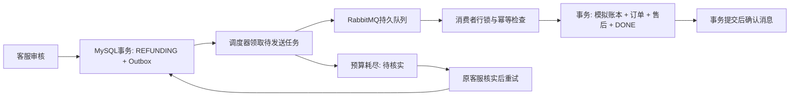

# P4a 可靠异步模拟退款

## 业务变化

此前审核通过会在同一请求内直接关闭订单并记录退款。现在审核事务只将售后改为 REFUNDING，并插入同 case_id 的 aster_refund_job。后台任务实际经过 RabbitMQ，消费者完成本地模拟退款事务后，才将售后改为 REFUNDED、订单关闭、任务标为 DONE。

客户和客服在详情页看到“模拟退款处理中”，每两秒刷新一次；列表未打开详情时仍使用显式刷新。退款待核实时展示对应状态，原领取客服可通过认证接口重新排队。按钮和文案不再承诺审核请求内立即完成。

## 一致性与投递语义

- 审核和 Outbox 同一 MySQL 事务，任务插入失败会回滚审核。并发领取使用条件 UPDATE，审核使用售后行锁。
- 调度器每两秒选取至多十个到期任务，以条件更新领取三十秒发送租约。进程故障后到期任务可重发；不将消息已发送等同于业务已成功。
- 消息为持久化纯数字 case ID；队列 durable。启用 publisher confirms 和 mandatory returns，等待确认最多五秒。未确认记录受控错误，保留任务重试。
- 消费器在事务代理返回后才由 AUTO ack 确认。模拟退款账本有 case_id 主键、order_id 与 reference 唯一约束；消费时对售后、任务和订单加锁并核对金额与状态。完成消息再次到来不会重复写账本或完成事件。
- 消费异常拒绝当前投递并进入 parking 队列，由仍在数据库中的任务按三十秒间隔继续重试，避免立即重入热循环。未知/格式错误消息只停放，不创建业务任务。
- 每轮最多二十次发送尝试，预算耗尽后转 REFUND_REVIEW/REVIEW。迟到消息不能跳过待核实状态。原领取客服认证后可重新排队，仍使用原业务幂等标识。

任务表既承载 Outbox 意图，也承载投递恢复状态，成功后保留 DONE 记录。模拟账本和业务表共享一个数据库事务；**这不是第三方支付渠道的分布式事务**。真正外部渠道还需独立幂等键、结果查询、未知状态和对账适配。消息语义是至少一次，不能宣传端到端 exactly-once。

## 部署与代码位置

- 增量迁移：deploy/mysql/migrations/007-p4-refund-outbox.sql，由 init-p1.ps1 执行，既有退款不回填、不重放。
- RefundService：事务、金额校验、重复消费、预算耗尽与原客服重试。
- RefundWorker：队列声明、发送确认、调度领取与消息消费。
- 配置：仅 admin 启用 ASTER_REFUND_ENABLED，worker 当前与 admin 同进程，单消费者部署。不是独立退款微服务，也未完成多实例负载验收。
- Spring AMQP 依赖复用 Spring Boot 依赖管理；H2 仅用于事务测试。故障测试使用实际 MySQL 和 RabbitMQ。

## 验证记录

2026-09-15 构建及回归：17 项 Java 测试通过，其中新增五项验证审批/Outbox 原子性、两线程重复消费、金额变化回滚、预算耗尽与重试权限；74 项 Python/MCP 通过、3 项跳过；12 项浏览器测试通过；17 项 API 冒烟检查完成。完整回归结束后显式模型 fixture 已关闭，本轮未调用付费模型。

独立执行 scripts/verify-p4.ps1，合成 case 65 / order 94 验证：

1. 两次并发领取只有一个成功者。
2. RabbitMQ 停机时两次并发审核只有一个成功者，任务 PENDING、模拟账本零行、订单仍为已支付状态。
3. 停止 admin worker，再恢复 RabbitMQ 和 worker，任务收敛为 DONE。
4. 再通过实际 RabbitMQ 投递两次同一 case ID，消费后账本一行、REFUNDED 事件一行，订单和售后状态一致。

本机结果：.local/p4-verification.json；构建、回归与故障日志分别在 .local/p4-build.log、.local/p4-verification.log、.local/p4-fault.log。故障脚本必须与其他测试串行运行，finally 恢复 RabbitMQ/admin。没有在真实 MySQL 上穷举所有崩溃窗口；例如“提交后 ack 前精确杀进程”尚未注入，重复投递只验证该窗口重投时所依赖的幂等行为。

## 下一步与能力映射

本轮已有可复现的消息队列、事务、行锁、条件更新、Outbox、至少一次投递、幂等、重试和进程恢复案例。下一步优先补消费者故障/死信可观测性、待核实业务查询和对账工具，再做分档并发压测与数据库执行计划。RabbitMQ 当前为单节点，未测试节点高可用；parking 清理和报警、任务归档、多实例租约/吞吐、外部渠道不确定结果都尚未验收。

Redis 缓存与限流后续基于热点和容量数据实施；数据库正确性不能依赖仅有一个 Redis 锁。分布式能力体现为服务间状态传播、重复与失败后的收敛，并非微服务数量。
