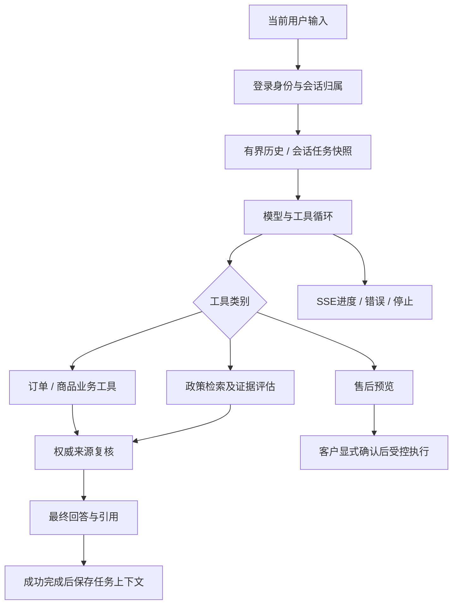

# Agent、上下文与政策检索

[文档首页](README.md) · [系统架构](architecture.md)

## 一次对话的边界

FastAPI负责请求与SSE，LangGraph组织有边界的执行与政策子图，MCP负责业务工具协议。LangChain Core在知识文档等结构中使用；没有为了列技术名而另加第二套全功能Agent框架。

## 工具

| 工具 | 作用 |
|---|---|
| `list_my_orders` / `get_my_order` | 当前客户订单，后端校验归属 |
| `list_my_after_sales` | 当前客户售后 |
| `search_products` / `get_product` | MySQL关键词、分类/价格条件、当前可售SKU数据 |
| `search_policies` | 已发布且客户可见的政策条款 |
| `preview_after_sale` / `get_operation_status` | 后端保存预览与查询操作状态 |

`submit_after_sale`属于确认后的受控路径，不向模型开放为任意可调用工具。`get_policy_source`用于宿主侧来源核验。具体名单以 [tools.py](../services/agent/aster_agent/tools.py) 和 [mcp_server.py](../services/agent/aster_agent/mcp_server.py) 为准。

商品检索没有向量化商品目录；网络搜索和第三方商家MCP也尚未接入。上述工具不能让助手代替客服批准退款。

## 政策 Agentic RAG

1. MySQL给出已发布/有效/可见条款的权威目录。
2. 中文BM25与Milvus向量召回各自候选。
3. RRF按排名融合，避免直接相加不同量纲的分数。
4. CrossEncoder精排得到有限候选，保留来源标识。
5. 有界LangGraph子流程评估证据是否足够；允许预算内补充检索，必要时澄清或拒绝编造。
6. 最终发布前重新读取来源，校验版本和内容哈希；政策变动可能使本次回答失败，而不是继续展示失效证据。

模型对证据的“足够”判断仍可能错误，哈希一致也不证明答案语义完全正确。检索失败降级和证据不足必须可见。最多两次政策搜索等预算说明见[证据门控记录](20-p3d-policy-evidence-gate.md)。

## 上下文与记忆

当前实现是会话内的有界历史、任务快照和宿主管理的商品引用。预算、品类、需求记录保留用户原话性质，不提升为业务事实。价格、库存、退款状态必须重新查询，不能从旧对话当作权威读出。

成功运行后才提升新的上下文；失败、停止或未确认操作不应被记成成功。不同用户/会话隔离。没有跨会话长期画像、全量记忆向量库或无限历史回放；参见[上下文设计](21-p3e-task-context.md)和[多轮验证](30-multiturn-shopping-evaluation.md)。

## 前端与模型连接

界面展示最终回答、可折叠工具执行记录、引用、业务卡片和错误。执行进度不是未经处理的模型内部推理，也不应将中间工具数据当成最终结论。

个人模型配置保存在服务端，密钥由独立部署密钥加密，不回显到页面或写入浏览器存储。自定义连接受公网HTTPS与地址校验限制；不同厂商的“兼容”不代表模型工具能力完全相同。保存配置、连接测试、完成业务对话是三个不同层次的验证。

## 如何阅读代码

按 `app.py → runtime.py → tools.py / mcp_server.py → business.py → Java` 追踪一次订单查询，再阅读 `policy_gate.py`对应的证据分支及测试。随后看 `store.py`、`preferences.py` 和 [AgentWorkspace.tsx](../apps/web/src/AgentWorkspace.tsx)，对照事件如何持久化并渲染。

准确的运行参数、预算和事件名称应从代码及对应阶段记录查证；文档不保证所有兼容模型都有相同token计量、停止行为或费用。
