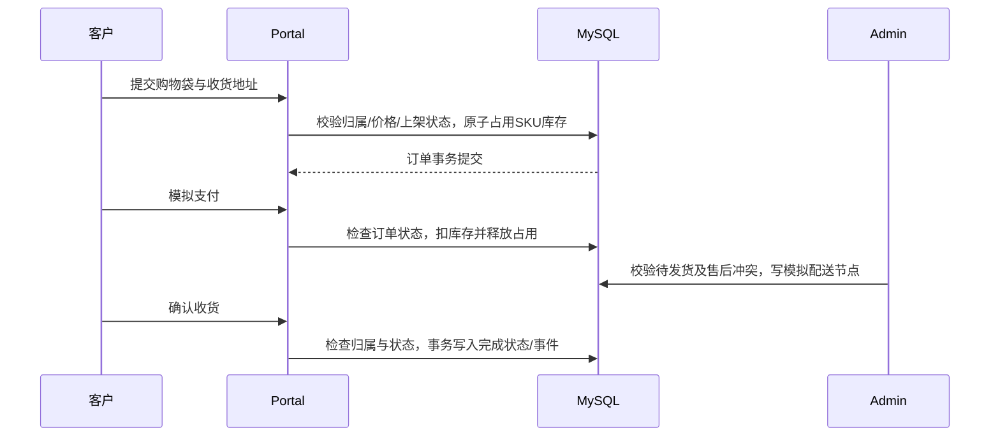

# 系统架构与信任边界

[文档首页](README.md) · [Agent链路](agent.md) · [工程学习](engineering-guide.md)

## 进程与职责

| 服务/组件 | 责任 | 不应承担的责任 |
|---|---|---|
| `apps/web` + Nginx | 三侧UI、同源代理、SSE展示、客户确认 | 决定业务权限、保存明文API Key |
| `mall-portal` | 客户身份、下单、客户业务及内部授权接口 | 根据模型自报ID授权 |
| `mall-admin` | 员工角色、管理操作、退款消费者 | 让普通客服调用管理接口 |
| `aster-after-sale` | 原创业务域：售后、确认操作、政策、退款、咨询、商品、履约 | 代替所有上游业务代码 |
| `services/agent` | 会话、模型调用、受控循环、工具与证据处理、SSE | 直接修改业务数据库绕开Java规则 |
| `commerce-mcp` | MCP协议适配，将授权传递给业务服务 | 把模型输入视为登录身份 |
| `retrieval-worker` | 当前政策快照、索引更新、向量/混合检索和精排 | 让撤回的旧向量继续成为权威数据 |

业务服务共享当前MySQL库。部署分进程不意味着已经实现独立数据库微服务、服务网格或分布式事务平台。

## 存储

| 存储 | 数据/作用 | 一致性说明 |
|---|---|---|
| MySQL | 用户、商品/SKU、订单、售后、政策与条款、Outbox、操作/咨询/履约记录 | 业务权威来源，关键写入使用事务/条件更新/行锁 |
| Redis | 上游登录相关缓存、验证码、订单号等能力 | 不将它宣称为新增商品缓存层或全站分布式锁方案 |
| RabbitMQ | 延迟取消等上游消息与新增模拟退款消息 | 可能重复投递，消费者必须幂等 |
| SQLite（Agent卷） | 会话/运行/事件、任务上下文、加密模型配置 | 当前本地持久化方案，横向扩展需重新设计 |
| Milvus | 已发布客户政策条款的向量索引 | 派生数据；按代际更新，不能取代MySQL来源校验 |
| MongoDB | 上游模块依赖 | 不是本项目业务交易或RAG的权威存储 |

## 交易链路

退款与履约另有边界：模拟发货不再次扣库存；售后申请不等于审批退款；咨询工单也不产生退款授权。旧上游支付/取消入口中的部分路径已明确禁用，不能为通过测试随意打开。

## 异步模拟退款

客服审批时，同一MySQL事务写入退款任务与业务状态。投递器发送RabbitMQ消息；消费者核验业务状态并以唯一记录/状态机抵御重复消息，写入本地模拟退款账本，完成售后并关闭订单。失败可重试，耗尽进入人工核实；监控页面提供只读核对。

这里的业务结果和模拟账本共享数据库事务，不是外部支付网关的跨系统一致性证明。Publisher confirm只证明消息投递阶段，不代表钱款退款成功。详见[退款设计](25-p4a-reliable-refunds.md)。

## 政策更新

政策发布/修订/撤回同时变更权威条款与索引任务。单worker读取一致快照，使用固定模型构建对应代际索引，校验摘要后切换；MCP检索检查代际，不可用时明确降级BM25。回答发布前重新核验政策版本、可见性和内容哈希。

约束：只能按当前设计运行一个索引worker；扩大前需要任务租约、fencing和并发发布设计。实验集合与线上集合隔离，不能把离线草案直接当作客户政策。

## 权限与身份

- Portal/Admin分别登录；页面路由不是权限边界，后端仍需检查用户/角色。
- Agent通过Java换取短期执行授权，再传递给MCP；客户JWT和模型密钥不作为模型工具参数。
- 读取订单、咨询及客户配置均按所属用户限定。
- 敏感写入使用后端保存的预览与确认状态，不信任模型描述的金额或用户身份。
- 外部模型返回、政策正文和客户输入均视为数据，不能充当授权指令。

## 代码入口

- [原创业务模块](../services/commerce/aster-after-sale/src/main/java/com/macro/mall/aster)
- [管理员入口](../services/commerce/mall-admin/src/main/java/com/macro/mall/aster/admin)
- [客户入口](../services/commerce/mall-portal/src/main/java/com/macro/mall/portal/controller)
- [Agent运行时](../services/agent/aster_agent/runtime.py)
- [MCP工具客户端](../services/agent/aster_agent/tools.py)
- [在线检索服务](../services/retrieval/online.py)
- [网页入口](../apps/web/src/App.tsx)

## 当前限制

没有完成所有上游接口的全面安全/并发审计；新增流水也不覆盖直接SQL及全部遗留管理写入。没有Kubernetes、自动扩缩容、生产监控告警、跨区域容灾或零停机数据库迁移承诺。工程能力用已有链路和证据说明，不用容器数量推断生产成熟度。
