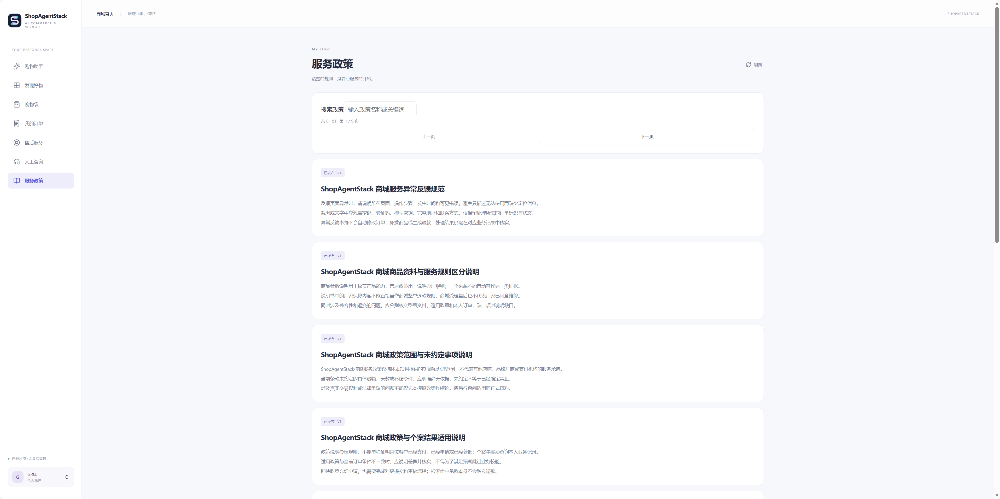
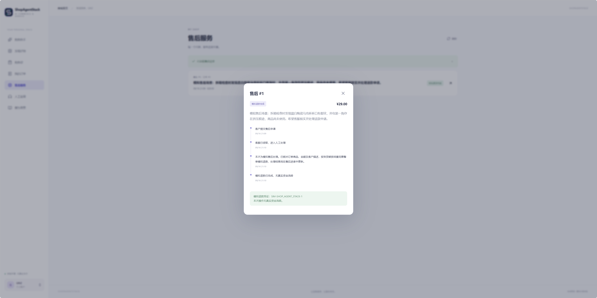
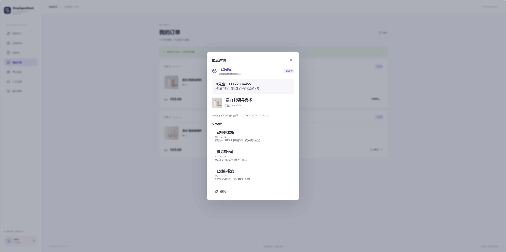
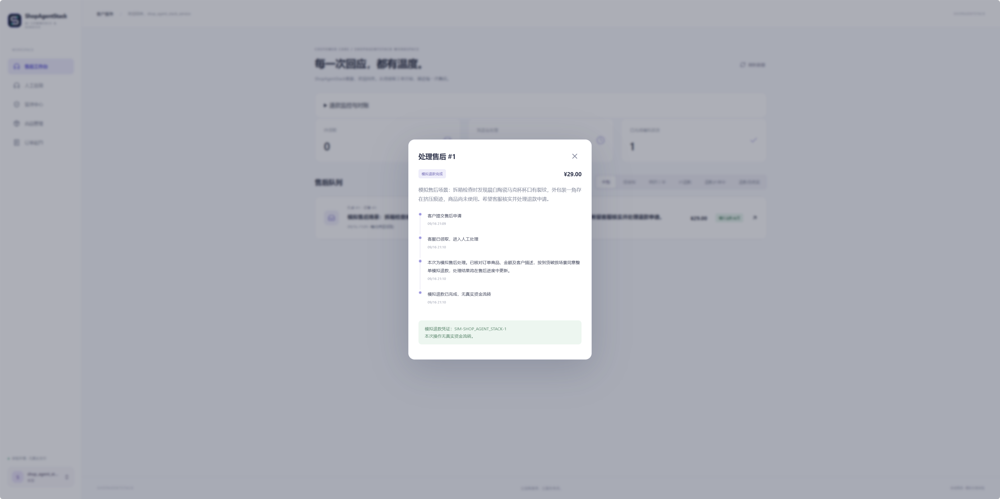
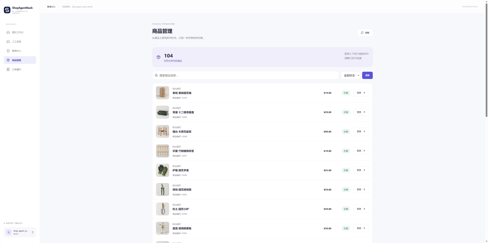
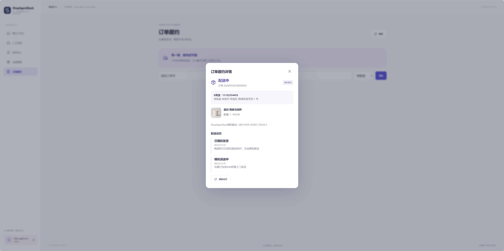
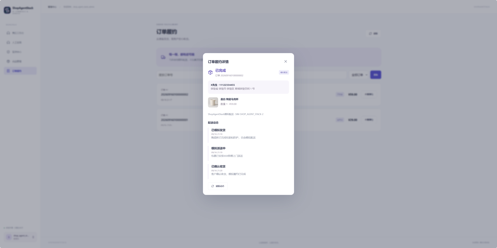

# 产品展示

[项目首页](../README.md) · [本地运行](getting-started.md) · [数据与测试](testing.md)

以下截图由维护者提供，展示 ShopAgentStack 本机应用的商品问答、政策引用、售后处理与后台管理。商品和政策为合成内容，支付、退款和配送均为模拟流程。图片可点击查看原始尺寸。

[客户侧](#customer) · [客服侧](#service) · [管理员侧](#admin)

## 客户侧

### 商品目录

分类、搜索与商品卡片展示 104 件体验商品，客户可以进入商品详情或加入购物袋。

### 商品问答与依据

按「50 元以内的玻璃杯」查询商品，回答展示价格、规格、材质与使用说明，并提供商品依据卡片。截图中的价格和库存为当次查询结果。

### 政策检索与引用

助手结合订单查询结果与政策条款，说明申请条件、原因填写要求和审核方，提供条款标识及可打开的来源卡片。本次咨询未创建申请。

### 服务政策浏览

客户可搜索、分页阅读已发布的可见政策。页面显示名称、版本和正文；员工内部材料不在客户政策列表中。

### 售后处理结果

客户侧展示申请提交、客服领取、审核说明及 29 元模拟退款完成记录。

### 配送与确认收货

客户查看陶瓷马克杯订单的模拟发货、派送与确认收货记录。收货人及联系方式为虚拟占位信息；这是独立的 59 元履约示例，与上方 29 元售后示例不是同一笔订单。

## 客服侧

### 售后审核

客服领取后填写客户可见的审核说明，再决定通过或拒绝。截图展示提交审核决定前的表单。

### 模拟退款完成

同一申请完成后，审核记录、退款状态与模拟凭证进入时间线，客户侧与客服侧均可查看结果。

## 管理员侧

### 商品管理

搜索商品、筛选状态，查看价格与上下架情况，并进入单个商品的规格管理。

### 规格库存

查看总库存、订单占用与可售库存，填写调整数量及原因。截图展示调整入口，当前所选规格尚无调整记录。

### 政策与可见性

管理中心显示 97 份已发布政策、草稿与团队账户数量。列表同时展示内部 SOP 的可见性、版本和索引状态，支持修订与撤回。

### 订单履约

员工侧查看同一笔陶瓷马克杯订单，从模拟配送中到客户确认收货后的完成状态，配送备注与时间线保持可追踪。

## 展示素材

图片由维护者提供，保留实际界面内容，来源及文件目录见[素材清单](assets/screenshots/manifest.json)。展示使用合成业务与模拟支付、退款、配送流程。截图用于说明界面与操作状态；测试方法见[数据与测试](testing.md)。
